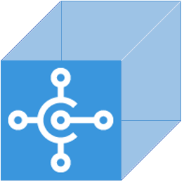

# AL Extension Pack

This pack includes extensions to improve your D365BC AL development.

---

## Extensions

The AL Extnsion Pack includes:

* [AL Formatter](https://marketplace.visualstudio.com/items?itemName=rasmus.al-formatter)
* [AL Language](https://marketplace.visualstudio.com/items?itemName=ms-dynamics-smb.al)
* [AL Navigator](https://marketplace.visualstudio.com/items?itemName=wbrakowski.al-navigator)
* [AL Object Designer](https://marketplace.visualstudio.com/items?itemName=martonsagi.al-object-designer)
* [AL Structure Creator](https://marketplace.visualstudio.com/items?itemName=EdySpider.alstructurecreator)
* [AL Test Runner](https://marketplace.visualstudio.com/items?itemName=jamespearson.al-test-runner)
* [AL Toolbox](https://marketplace.visualstudio.com/items?itemName=BartPermentier.al-toolbox)
* [AL Variable Helper](https://marketplace.visualstudio.com/items?itemName=rasmus.al-var-helper)
* [AL XML Documentation](https://marketplace.visualstudio.com/items?itemName=365businessdevelopment.bdev-al-xml-doc)
* [AZ AL Dev Tools/AL Code Outline](https://marketplace.visualstudio.com/items?itemName=andrzejzwierzchowski.al-code-outline)
* [Azure Repos](https://marketplace.visualstudio.com/items?itemName=ms-vsts.team)
* [Bracket Pair Colorizer 2](https://marketplace.visualstudio.com/items?itemName=CoenraadS.bracket-pair-colorizer-2)
* [Create GUID](https://marketplace.visualstudio.com/items?itemName=nwallace.createGUID)
* [Debugger for Chrome](https://marketplace.visualstudio.com/items?itemName=msjsdiag.debugger-for-chrome)
* [Docker](https://marketplace.visualstudio.com/items?itemName=ms-azuretools.vscode-docker)
* [Docker Explorer](https://marketplace.visualstudio.com/items?itemName=formulahendry.docker-explorer)
* [Dynamics NAV C/AL](https://marketplace.visualstudio.com/items?itemName=zodiacfireworks.vscode-c-al)
* [Git History](https://marketplace.visualstudio.com/items?itemName=donjayamanne.githistory)
* [GitLens — Git supercharged](https://marketplace.visualstudio.com/items?itemName=eamodio.gitlens)
* [Live Share](https://marketplace.visualstudio.com/items?itemName=MS-vsliveshare.vsliveshare)
* [PowerShell](https://marketplace.visualstudio.com/items?itemName=ms-vscode.PowerShell)
* [Remote - Containers](https://marketplace.visualstudio.com/items?itemName=ms-vscode-remote.remote-containers)
* [REST Client](https://marketplace.visualstudio.com/items?itemName=humao.rest-client)
* [TSLint](https://marketplace.visualstudio.com/items?itemName=ms-vscode.vscode-typescript-tslint-plugin)
* [VSCode-Icons](https://marketplace.visualstudio.com/items?itemName=vscode-icons-team.vscode-icons)
* [Waldo's CRS AL Language Extension](https://marketplace.visualstudio.com/items?itemName=waldo.crs-al-language-extension)
* [XLIFF Sync](https://marketplace.visualstudio.com/items?itemName=rvanbekkum.xliff-sync)

---

## Release Notes

### 0.0.1

Initial release.

### 0.0.2

Update documentation.

### 0.0.3

Include new extensions.

---

## Authors

* [**EdySpider**](https://github.com/edyspider/)

See also the list of [contributors](https://github.com/edyspider/ALExtensionPack/contributors) who participated in this project.

---

## License

- **[MIT license](https://github.com/edyspider/ALExtensionPack/blob/master/LICENSE)**
- Copyright 2020 &copy; <a href="https://github.com/edyspider" target="_blank">EdySpider</a>.

